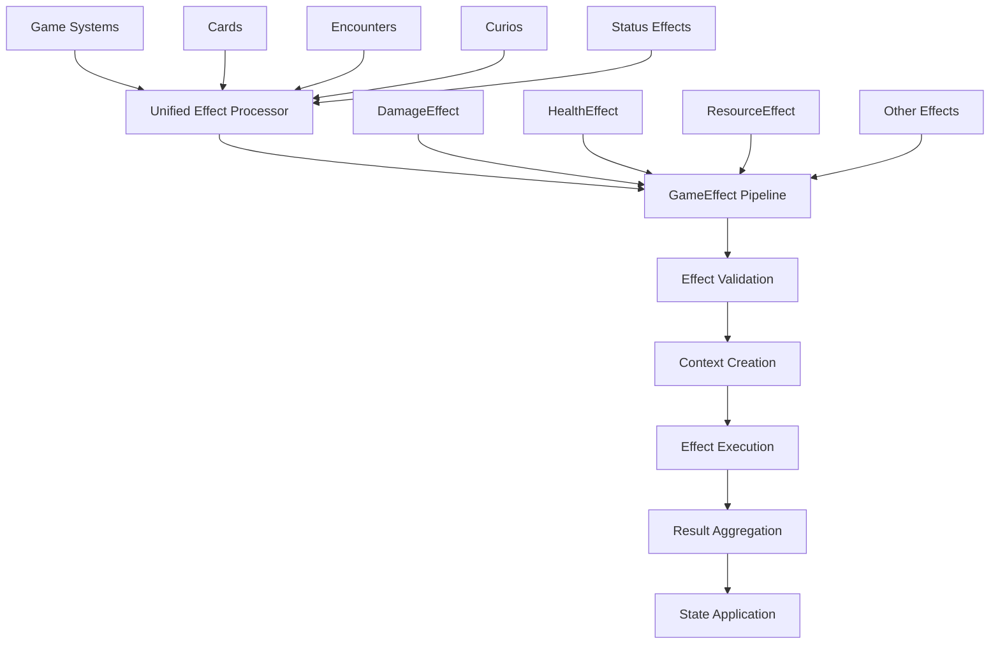

# Design Document

## Overview

This design outlines the systematic cleanup and optimization of the game's effect system following the successful migration from legacy CardEffects to the modern GameEffect architecture. The cleanup will remove redundant code, eliminate legacy adapters, consolidate processing pipelines, and optimize performance while maintaining full backward compatibility.

The current system has both legacy and modern components running in parallel, creating confusion and inefficiency. This cleanup will result in a single, unified effect processing system that handles all effects (cards, encounters, curios, status effects) through the same GameEffect pipeline.

## Architecture

### Current State Analysis

The current system has these components:

1. **Modern GameEffect System** (Target Architecture)
   - `GameEffect` base class with proper inheritance hierarchy
   - `EffectContext` for passing state and parameters
   - `EffectResult` for returning processing results
   - Specific effect types: `DamageEffect`, `HealthEffect`, `ResourceEffect`, etc.
   - `EffectRegistry` for effect type management

2. **Legacy CardEffects System** (To Be Removed)
   - `CardEffects` class with card-specific processing logic
   - Dictionary-based result aggregation
   - Hardcoded effect type handling
   - Direct state mutation during processing

3. **Wrapper Classes** (To Be Evaluated)
   - `CardEffectWrapper`, `CurioEffectWrapper`, `EncounterEffectWrapper`
   - Add source-specific metadata to base effects
   - May be redundant with proper GameEffect design

4. **Legacy Adapters** (To Be Removed)
   - `LegacyCurioAdapter`, `LegacyEncounterAdapter`
   - Incomplete migration helpers
   - No longer needed

### Target Architecture



## Components and Interfaces

### Unified Effect Processor

A new centralized processor that replaces the legacy CardEffects system:

```gdscript
# scripts/systems/effect_processor.gd
extends Node
class_name EffectProcessor

signal effect_executed(effect: GameEffect, result: EffectResult, context: EffectContext)
signal effect_failed(effect: GameEffect, reason: String, context: EffectContext)
signal batch_completed(results: Array[EffectResult])

func process_effects(effects: Array[GameEffect], context: EffectContext) -> Array[EffectResult]
func process_single_effect(effect: GameEffect, context: EffectContext) -> EffectResult
func create_context_for_card(card_instance: CardInstance, duel_manager: DuelManager) -> EffectContext
func create_context_for_encounter(encounter: EncounterData, player_data: PlayerData) -> EffectContext
func create_context_for_curio(curio: CurioData, trigger_event: String, game_state: Resource) -> EffectContext
```

### Enhanced GameEffect Base Class

Extend the existing GameEffect to handle source-specific behavior without wrappers:

```gdscript
# Enhanced scripts/effects/core/game_effect.gd
extends Resource
class_name GameEffect

# Source context (replaces wrapper functionality)
@export var source_constraints: Dictionary = {} # Conditions specific to source type
@export var trigger_events: Array[String] = [] # When this effect should activate
@export var source_metadata: Dictionary = {} # Source-specific data

# Processing methods
func apply_effect(context: EffectContext) -> EffectResult
func can_apply(context: EffectContext) -> bool
func get_preview_text(context: EffectContext) -> String
func validate_context(context: EffectContext) -> bool
```

### Streamlined Context System

Optimize EffectContext to reduce allocations and improve performance:

```gdscript
# Enhanced scripts/effects/core/effect_context.gd
extends Resource
class_name EffectContext

# Core state (always present)
@export var source_type: String
@export var source_object: Resource
@export var player_data: Resource
@export var trigger_event: String

# Optional state (null when not applicable)
var duel_manager: DuelManager
var enemy_data: Resource
var game_manager: GameManager

# Cached calculations (populated on demand)
var _curio_modifications: Dictionary
var _conditional_values: Dictionary

# Performance optimization methods
func get_curio_modifications() -> Dictionary
func cache_conditional_values(effect: GameEffect) -> void
func clear_cache() -> void
```

## Data Models

### Effect Processing Pipeline

The unified processing pipeline will handle all effect types:

1. **Input Validation**
   - Validate effect instances
   - Validate context completeness
   - Check source compatibility

2. **Context Preparation**
   - Create appropriate EffectContext
   - Populate curio modifications
   - Cache conditional values

3. **Effect Execution**
   - Apply conditional logic
   - Execute effect-specific logic
   - Generate EffectResult

4. **Result Aggregation**
   - Combine multiple effect results
   - Resolve conflicts and priorities
   - Prepare final state changes

5. **State Application**
   - Apply changes to game state
   - Trigger follow-up effects
   - Update UI and logs

### Migration Strategy

The cleanup will follow this phased approach:

**Phase 1: Create Unified Processor**
- Implement new EffectProcessor class
- Add methods for all source types
- Maintain parallel operation with legacy system

**Phase 2: Migrate DuelManager**
- Replace CardEffects usage with EffectProcessor
- Update card effect processing calls
- Verify identical behavior

**Phase 3: Remove Legacy Components**
- Delete CardEffects class
- Remove unused wrapper classes
- Delete incomplete adapter classes

**Phase 4: Optimize and Polish**
- Optimize context creation and caching
- Add comprehensive logging
- Update documentation

## Correctness Properties

Let me analyze the acceptance criteria for testability:

<function_calls>
<invoke name="prework">
<parameter name="featureName">effect-system-cleanup

## Correctness Properties

*A property is a characteristic or behavior that should hold true across all valid executions of a system-essentially, a formal statement about what the system should do. Properties serve as the bridge between human-readable specifications and machine-verifiable correctness guarantees.*

After analyzing the acceptance criteria, I've identified several redundant properties that can be consolidated:

**Property Reflection:**
- Properties 1.1, 1.3, and 6.2 all test functional equivalence and can be combined into one comprehensive behavioral equivalence property
- Properties 4.1 and 4.2 both test processing method consistency and can be combined
- Properties 5.1, 5.2, 5.3, and 5.4 all test performance optimization aspects and can be combined into one performance property
- Properties 6.1 and 6.3 both test data compatibility and can be combined

### Property 1: Behavioral Equivalence After Cleanup
*For any* card, encounter, or curio effect processing scenario, the gameplay results produced after cleanup should be identical to the results produced before cleanup.
**Validates: Requirements 1.1, 1.3, 6.2, 6.4**

### Property 2: Unified Processing Pipeline Usage
*For any* effect from any source (card, encounter, curio, status), the system should use the same core GameEffect processing methods and produce consistent EffectResult structures.
**Validates: Requirements 1.2, 4.1, 4.2, 4.3**

### Property 3: Direct GameEffect Processing
*For any* effect processing operation, the system should process direct GameEffect instances without using wrapper classes or adapter layers.
**Validates: Requirements 2.3, 3.3**

### Property 4: Data Compatibility Preservation
*For any* existing .tres resource file or save file, the system should load and process the data correctly after cleanup without errors or data loss.
**Validates: Requirements 3.2, 6.1, 6.3**

### Property 5: Performance Optimization
*For any* effect processing operation, the system should minimize object allocations, reuse context objects where possible, eliminate redundant validation steps, and process batches of effects efficiently.
**Validates: Requirements 5.1, 5.2, 5.3, 5.4**

### Property 6: Wrapper Removal Equivalence
*For any* effect that previously used wrapper classes, the system should maintain identical functionality when processing the effect directly.
**Validates: Requirements 2.2**

### Property 7: Logging and Debugging Capability
*For any* effect processing operation, the system should generate appropriate log messages and debugging information to aid in troubleshooting.
**Validates: Requirements 7.3**

### Property 8: Deterministic Processing
*For any* effect processing scenario, running the same effects multiple times with identical inputs should produce identical results.
**Validates: Requirements 8.2**

### Property 9: Graceful Error Handling
*For any* edge case or invalid input during effect processing, the system should handle the situation gracefully without crashing or corrupting game state.
**Validates: Requirements 8.3**

## Error Handling

The cleanup process must handle several categories of errors:

### Migration Errors
- **Missing Dependencies**: When removing legacy code, ensure all dependencies are properly updated
- **Data Format Changes**: Handle cases where existing data files reference removed classes
- **API Changes**: Ensure all calling code is updated to use new interfaces

### Runtime Errors
- **Invalid Effect Types**: Handle cases where effects can't be processed
- **Missing Context**: Gracefully handle incomplete EffectContext instances
- **State Corruption**: Detect and recover from invalid game state during effect processing

### Performance Degradation
- **Memory Leaks**: Monitor for increased memory usage after cleanup
- **Processing Slowdowns**: Ensure cleanup doesn't negatively impact performance
- **Context Creation Overhead**: Optimize context creation to avoid performance regression

## Testing Strategy

### Property-Based Testing
The cleanup will be validated using property-based testing with a minimum of 100 iterations per property test. Each property test will be tagged with the format: **Feature: effect-system-cleanup, Property {number}: {property_text}**

**Testing Framework**: Use Godot's built-in testing framework with custom property test utilities for generating random effect scenarios.

**Test Data Generation**:
- Generate random card instances with various effect combinations
- Create random encounter scenarios with different choice outcomes  
- Generate curio configurations with various trigger conditions
- Create edge case scenarios (empty effects, null contexts, invalid data)

### Unit Testing
Unit tests will focus on specific examples and integration points:

**Legacy System Removal**:
- Test that CardEffects class is completely removed
- Verify no legacy method calls remain in codebase
- Test that DuelManager uses only EffectProcessor

**Wrapper Class Evaluation**:
- Test direct GameEffect processing vs wrapped processing
- Verify functionality preservation after wrapper removal
- Test source-specific metadata handling

**Adapter Removal**:
- Test data file loading after adapter removal
- Verify no adapter code paths are executed
- Test backward compatibility with existing resources

**Performance Optimization**:
- Benchmark effect processing before and after cleanup
- Monitor memory allocation patterns
- Test context reuse and caching mechanisms

### Integration Testing
Integration tests will verify the complete effect processing pipeline:

**Cross-System Compatibility**:
- Test card effects in combat scenarios
- Test encounter effects in exploration
- Test curio effects across different game states
- Test status effects with various triggers

**Data Migration**:
- Load existing save files and verify compatibility
- Test resource file loading across all effect types
- Verify no data corruption during cleanup

**Performance Regression**:
- Run performance benchmarks on complex effect scenarios
- Test memory usage under sustained effect processing
- Verify no performance degradation in critical paths

The testing strategy ensures comprehensive coverage while maintaining focus on the most critical aspects of the cleanup: behavioral equivalence, performance optimization, and data compatibility.