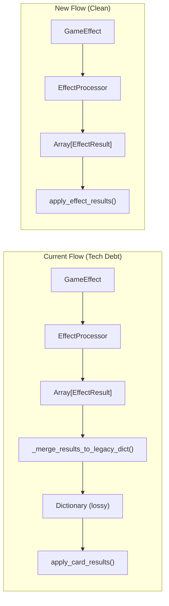

# Design Document: Legacy Dict Cleanup

## Overview

This design eliminates the `_merge_results_to_legacy_dict()` conversion layer by having `DuelManager` consume `EffectResult` arrays directly. The refactor consolidates effect application into a single unified method that handles both player and enemy cards with configurable source/target parameters.

## Architecture



The key change is removing the intermediate conversion step that loses data.

## Components and Interfaces

### EffectResult (Unchanged)

The modern effect result format remains unchanged:

```gdscript
class_name EffectResult
extends Resource

@export var success: bool = true
@export var values_applied: Dictionary = {}  # Flexible key-value pairs
@export var prevented_by: String = ""
@export var critical: bool = false
@export var overkill: int = 0
@export var triggers: Array[String] = []
@export var ui_feedback: Dictionary = {}
@export var logs: Array[String] = []
```

### DuelManager Changes

Replace `apply_card_results(results: Dictionary)` and `apply_enemy_card_results(results: Dictionary, enemy)` with a single unified method:

```gdscript
## Apply effect results from processed effects
## source: The entity that played the card (gains defense, spends resources)
## target: The entity receiving damage/debuffs
func apply_effect_results(effect_results: Array[EffectResult], source: PlayerData, target) -> void:
    for result in effect_results:
        if not result.success:
            continue
        _apply_single_result(result.values_applied, source, target)

func _apply_single_result(values: Dictionary, source: PlayerData, target) -> void:
    # Damage goes to target
    if values.has("damage") and values.damage > 0:
        var ignore_defense = values.get("ignores_defense", false)
        var hits = int(values.get("damage_hits", 1))
        for i in range(max(1, hits)):
            target.take_damage(values.damage, ignore_defense)
    
    # Defense goes to source
    if values.has("defense") and values.defense > 0:
        source.gain_defense(values.defense)
    
    # Heal goes to source
    if values.has("heal") and values.heal > 0:
        source.heal(values.heal)
    
    # Draw cards (source's deck)
    if values.has("drawn") and values.drawn > 0:
        duel_state.draw_cards(values.drawn)
    
    # Custom resources (Faith, Ammo, Brew, etc.) go to source
    if values.has("custom_resources"):
        for resource_name in values.custom_resources:
            var amount = values.custom_resources[resource_name]
            source.modify_resource(resource_name, amount)
    
    # Gold goes to source
    if values.has("gold") and values.gold != 0:
        if source.stats:
            source.stats.gain_gold(values.gold)
    
    # Status effects go to target
    if values.has("stun_enemy") and values.stun_enemy > 0:
        target.apply_stun(values.stun_enemy)
    
    # Delayed effects
    if values.has("delayed_damage") and values.delayed_damage > 0:
        source.delayed_damage += values.delayed_damage
    
    if values.has("delayed_defense") and values.delayed_defense > 0:
        source.delayed_defense += values.delayed_defense
    
    # Energy restoration
    if values.has("energy") and values.energy != 0:
        source.restore_energy(values.energy)
    
    # Sanity restoration
    if values.has("sanity") and values.sanity > 0:
        source.restore_sanity(values.sanity)
    
    # Card manipulation
    if values.has("discard_random") and values.discard_random > 0:
        duel_state.discard_random_cards(values.discard_random)
    
    if values.has("exhaust_random") and values.exhaust_random > 0:
        duel_state.exhaust_random_cards(values.exhaust_random)
```

### EffectProcessor Changes

Remove the legacy conversion functions and return `Array[EffectResult]` directly:

```gdscript
## Process card effects and return results directly
func process_card_effects(card_instance: CardInstance, duel_manager: DuelManager) -> Array[EffectResult]:
    var context = _create_effect_context(card_instance, duel_manager)
    
    var typed_effects: Array[GameEffect] = []
    for effect in card_instance.card_data.effects:
        if effect is GameEffect:
            typed_effects.append(effect)
    
    var effect_results = process_effects(typed_effects, context)
    
    # Apply gambling modifiers directly to results if applicable
    _apply_gambling_modifiers_to_results(duel_manager, effect_results)
    
    return effect_results

# REMOVED: _create_legacy_results_dict()
# REMOVED: _merge_results_to_legacy_dict()
```

### FaithEffect Changes

Update to use `custom_resources` format:

```gdscript
func apply_effect(context):
    var result = EffectResult.new()
    if not context:
        result.success = false
        result.prevented_by = "no_context"
        return result

    var final_amount = resolve_conditional_value("amount", amount, context)

    # Use custom_resources format for consistency
    if not result.values_applied.has("custom_resources"):
        result.values_applied["custom_resources"] = {}
    result.values_applied["custom_resources"]["Faith"] = final_amount
    result.success = true

    return result
```

## Data Models

### values_applied Key Reference

Standard keys that `apply_effect_results` handles:

| Key | Type | Description | Applied To |
|-----|------|-------------|------------|
| `damage` | int | Damage amount | Target |
| `damage_hits` | int | Number of hits (multi-strike) | Target |
| `ignores_defense` | bool | Bypass defense | Target |
| `defense` | int | Defense gained | Source |
| `heal` | int | Health restored | Source |
| `drawn` | int | Cards to draw | Source's deck |
| `discard_random` | int | Random cards to discard | Source's hand |
| `exhaust_random` | int | Random cards to exhaust | Source's hand |
| `energy` | int | Energy change | Source |
| `sanity` | int | Sanity restored | Source |
| `gold` | int | Gold change | Source |
| `stun_enemy` | int | Stun turns | Target |
| `delayed_damage` | int | Damage next turn | Source |
| `delayed_defense` | int | Defense next turn | Source |
| `custom_resources` | Dictionary | Resource changes (Faith, Ammo, etc.) | Source |


## Correctness Properties

*A property is a characteristic or behavior that should hold true across all valid executions of a system—essentially, a formal statement about what the system should do. Properties serve as the bridge between human-readable specifications and machine-verifiable correctness guarantees.*

Based on the prework analysis, the following properties consolidate the testable acceptance criteria:

### Property 1: Failed Results Are Skipped

*For any* EffectResult with `success=false`, applying it to game state SHALL result in zero state changes to player health, defense, resources, or any other tracked values.

**Validates: Requirements 1.3**

### Property 2: Known Keys Mutate Correct State

*For any* EffectResult with a known key in `values_applied` (damage, defense, heal, gold, custom_resources, etc.), the corresponding game state SHALL change by the specified amount.

**Validates: Requirements 1.2, 2.1, 2.2, 2.3, 2.4**

### Property 3: Unknown Keys Don't Crash

*For any* EffectResult containing an unknown key in `values_applied`, processing SHALL complete without error and other valid keys in the same result SHALL still be applied.

**Validates: Requirements 2.5**

### Property 4: Source/Target Assignment

*For any* card play (player or enemy), damage SHALL be applied to the target entity and defense SHALL be applied to the source entity.

**Validates: Requirements 5.1, 5.2**

### Property 5: FaithEffect Output Format

*For any* FaithEffect execution, the output `values_applied` SHALL contain `custom_resources["Faith"]` and SHALL NOT contain a top-level `"faith"` key.

**Validates: Requirements 2.1.1**

### Property 6: Custom Resources Are All Applied

*For any* `custom_resources` dictionary in `values_applied` containing N resource entries, all N resources SHALL be modified on the source entity.

**Validates: Requirements 2.2**

## Error Handling

### Unknown Keys
When `apply_effect_results` encounters an unknown key in `values_applied`:
1. Log a warning with the key name via GLog.warn()
2. Continue processing remaining keys in the same result
3. Continue processing remaining results in the array

### Invalid Targets
When source or target is null/invalid:
1. Log an error via GLog.error()
2. Skip the current result
3. Continue processing remaining results

### Malformed Results
When an EffectResult has invalid structure (e.g., values_applied is not a Dictionary):
1. Log a warning
2. Skip the result
3. Continue processing

## Testing Strategy

### Unit Tests
- Test each effect type (DamageEffect, DefenseEffect, etc.) produces correct `values_applied` structure
- Test `apply_effect_results` handles each known key correctly
- Test source/target assignment for player vs enemy cards
- Test error handling for unknown keys and invalid inputs

### Property-Based Tests
Using GdUnit4 or similar framework with randomized inputs:

1. **Failed Results Property**: Generate random EffectResults with `success=false`, verify no state changes
2. **Known Keys Property**: Generate random values for each known key, verify state changes match
3. **Unknown Keys Property**: Generate results with random unknown keys mixed with valid keys, verify no crashes and valid keys still work
4. **Source/Target Property**: Generate random damage/defense values, verify correct entity receives each
5. **FaithEffect Format Property**: Generate random faith amounts, verify output structure
6. **Custom Resources Property**: Generate random resource dictionaries, verify all applied

### Integration Tests
- Play a card with multiple effects, verify all effects apply correctly
- Play enemy card, verify reversed source/target
- Test gambling modifier integration with new system
