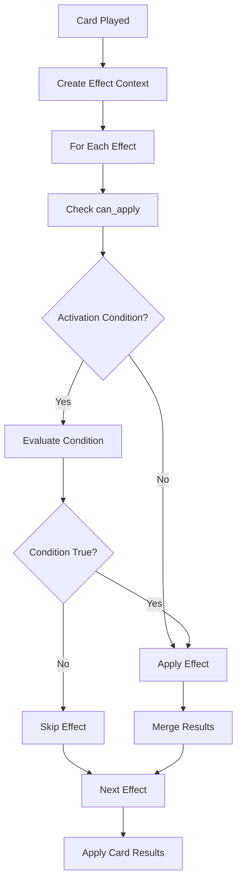

# Design Document

## Overview

This design addresses the bug where the Quick Shot card's conditional draw effect fails to trigger when played as the first card in a turn. The issue stems from improper handling of activation conditions in the card effect system, specifically in how the `CardManipulationEffect` processes its `activation_condition` property.

## Architecture

The fix involves three main components:

1. **Effect Processing Pipeline**: Ensure activation conditions are properly evaluated before effect application
2. **Context Data Flow**: Verify that timing data (cards_played_this_turn) is correctly passed to effects
3. **Result Processing**: Ensure card manipulation results are properly converted and applied



## Components and Interfaces

### EffectContext Enhancement
The `EffectContext` class already contains the necessary structure with `trigger_data` dictionary containing timing information. No changes needed to the interface.

### CardManipulationEffect Fix
The `CardManipulationEffect` class inherits from `GameEffect` which provides the `can_apply()` method that checks `activation_condition`. The effect system already calls this method, so the issue is likely in the condition evaluation or context data.

### Condition Evaluation Chain
```
DuelManager.play_card() 
  -> captures cards_played_before 
  -> creates context with timing data
  -> CardEffects.apply_card_instance_effects_with_context()
    -> _apply_single_effect_with_context()
      -> effect.can_apply(context)
        -> activation_condition.evaluate(context)
```

## Data Models

### Context Data Structure
```gdscript
trigger_data = {
    "cards_played_this_turn": int,  # Count BEFORE current card
    "hand_size": int,               # Hand size BEFORE current card
    "card_instance": CardInstance,
    "duel_state": DuelState
}
```

### Effect Result Structure
```gdscript
values_applied = {
    "drawn": int,        # Set by CardManipulationEffect
    # Converted to "draw" by _merge_effect_result_into_results
}
```

## Root Cause Analysis

Based on code analysis, the system appears to be correctly structured. The likely issues are:

1. **Timing Data**: The `cards_played_this_turn` value in context may not reflect the correct state
2. **Condition Logic**: The `EffectCondition.evaluate()` method may have bugs in accessing context data
3. **Context Access**: The condition evaluation may not be accessing the trigger_data correctly

## Debugging Strategy

The fix will include comprehensive logging to identify where the failure occurs:

1. Log context creation with timing data
2. Log activation condition evaluation steps
3. Log effect application decisions
4. Log result processing and conversion

## Error Handling

Enhanced error handling will include:

1. Graceful handling of missing context data
2. Clear error messages for condition evaluation failures
3. Fallback behavior for malformed conditions
4. Validation of effect results before processing

## Testing Strategy

### Unit Tests
- Test `EffectCondition.evaluate()` with various context states
- Test `CardManipulationEffect.apply_effect()` with and without conditions
- Test context creation with correct timing data
- Test result merging and conversion

### Property-Based Tests
Property-based tests will be implemented using GDScript's built-in testing framework with custom property generators.

**Dual Testing Approach**:
- Unit tests verify specific examples, edge cases, and error conditions
- Property tests verify universal properties across all inputs
- Both are complementary and necessary for comprehensive coverage

**Property Test Configuration**:
- Minimum 100 iterations per property test
- Each property test references its design document property
- Tag format: **Feature: quickshot-card-fix, Property {number}: {property_text}**

## Correctness Properties

*A property is a characteristic or behavior that should hold true across all valid executions of a system-essentially, a formal statement about what the system should do. Properties serve as the bridge between human-readable specifications and machine-verifiable correctness guarantees.*

### Property 1: Quick Shot Conditional Draw Behavior
*For any* game state and Quick Shot card, when played as the first card in a turn, exactly 1 card should be drawn, and when played as a subsequent card, no cards should be drawn
**Validates: Requirements 1.1, 1.2**

### Property 2: Quick Shot Damage Consistency  
*For any* game state, when Quick Shot is played, exactly 4 damage should be dealt regardless of turn position or conditions
**Validates: Requirements 1.3**

### Property 3: Draw Effect Hand Integration
*For any* successful draw effect, the drawn card should immediately appear in the player's hand and be available for play
**Validates: Requirements 1.4**

### Property 4: Activation Condition Evaluation
*For any* effect with an activation condition, the condition should be evaluated before effect application, and the effect should only apply if the condition is true
**Validates: Requirements 2.1, 2.2, 2.3**

### Property 5: Context Data Integrity
*For any* effect evaluation, the context should contain accurate game state data including correct timing information captured at the appropriate moment
**Validates: Requirements 2.4, 4.1, 4.2, 4.3**

### Property 6: First Card Condition Logic
*For any* first card condition evaluation, the result should be true when cards_played_this_turn equals 0 and false otherwise
**Validates: Requirements 3.1, 3.2, 3.3**

### Property 7: Error Handling Robustness
*For any* missing, null, or invalid context data, condition evaluation should fail gracefully and return false rather than causing errors
**Validates: Requirements 3.4, 4.4**

### Property 8: Effect Result Population
*For any* successful card manipulation effect, the effect result should contain the appropriate values in the correct format
**Validates: Requirements 5.1**

### Property 9: Result Conversion Accuracy
*For any* card manipulation effect result, "drawn" values should be correctly converted to "draw" values during result processing
**Validates: Requirements 5.2**

### Property 10: Draw Operation Execution
*For any* draw effect result, the actual card movement should occur from deck to hand, updating both pile sizes correctly
**Validates: Requirements 5.3, 5.4**